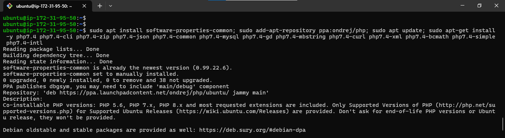
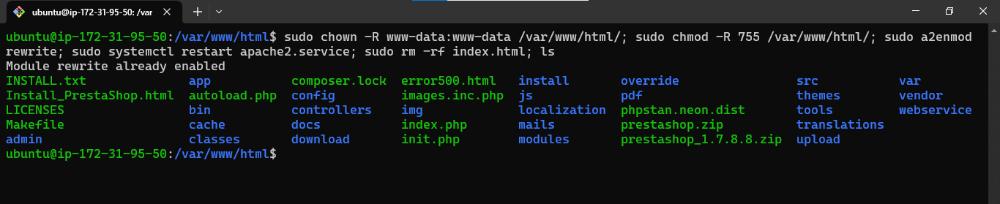
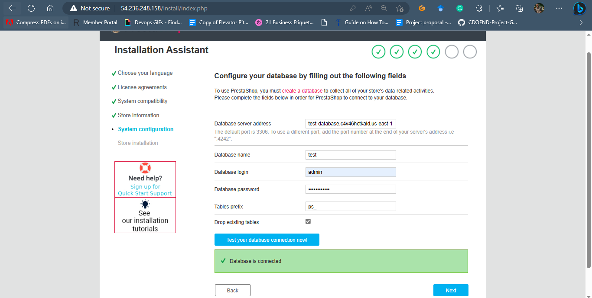

## **How to install and setup Prestashop on AWS**

PrestaShop is an open-source E-Commence platform that is free to use. It is one of the most popular E-Commence website builder platforms and has an intuitive interface that makes it easy to manage your online store.

PrestaShop is easy to use and offers a responsive store interface for shoppers. Prestashop It provides a complete set of features free of cost.

## Requirements to install Prestashop:

- Ubuntu 20.04 0r higher
- System Requirements 1GB of RAM, 2 CPU Cores, 1 GB of Disk space
- Apache2 Webserver which  is one of the most popular web servers in the world.
- AWS RDS (MYSQL) 5.0 or higher: MYSQL is a popular database management system used within PHP environments
- PHP7.4 which is a general-purpose open-source scripting language and one of the most popular programming languages for web development

## Step 1: Update system and install Apache Webserver

To begin, update the package manager cache

    sudo apt update; sudo apt install apache2 -y

## Step 2: Install PHP7.4

    sudo apt install software-properties-common; sudo add-apt-repository ppa:ondrej/php; sudo apt update; sudo apt-get install -y php7.4 php7.4-cli php7.4-zip php7.4-json php7.4-common php7.4-mysql php7.4-gd php7.4-mbstring php7.4-curl php7.4-xml php7.4-bcmath php7.4-simple php7.4-intl

## Step 3: Connect to AWS RDS using the Endpoint and Create Database

    sudo apt install mysql-client

    sudo mysql -h test-database.c4v46hctkald.us-east-1.rds.amazonaws.com -u admin -p
---

    create database db;
    show databases;
    exit

## Step 4: Install Prestashop Version 1.7.8.8

Download the zip file and then unzip the downloaded file.

    cd /var/www/html; sudo curl -LO https://www.prestashop.com/en/system/files/ps_releases/prestashop_1.7.8.8.zip; sudo apt install unzip; ls; sudo unzip prestashop_1.7.8.8.zip

After unzipping the downloaded file, you will get prestashop.zip, and then you can store it in /var/www/html

    sudo unzip prestashop.zip; ls

The directory permissions need to be set accordingly

    sudo chown -R www-data:www-data /var/www/html/; sudo chmod -R 755 /var/www/html/; sudo a2enmod rewrite; sudo systemctl restart apache2.service; sudo rm -rf index.html

To complete the installation, go to http://yourpublicipaddress

## Step 5: Choose your language then click Next

## Step 6: Click "Next" after agreeing to the terms and conditions.

## Step 7: Add information about your store

To enable SSL for your e-commerce website, you need to enable SSL

## Step 8 : Configure your database with the credentials you created when creating your AWS RDS and test the connection

After installation, a window will appear

Finally, close the window and revist your your ste using http://yourpublicaddress

---

## 🔗 Contacts

## MICHAEL AGBIAOWEI

